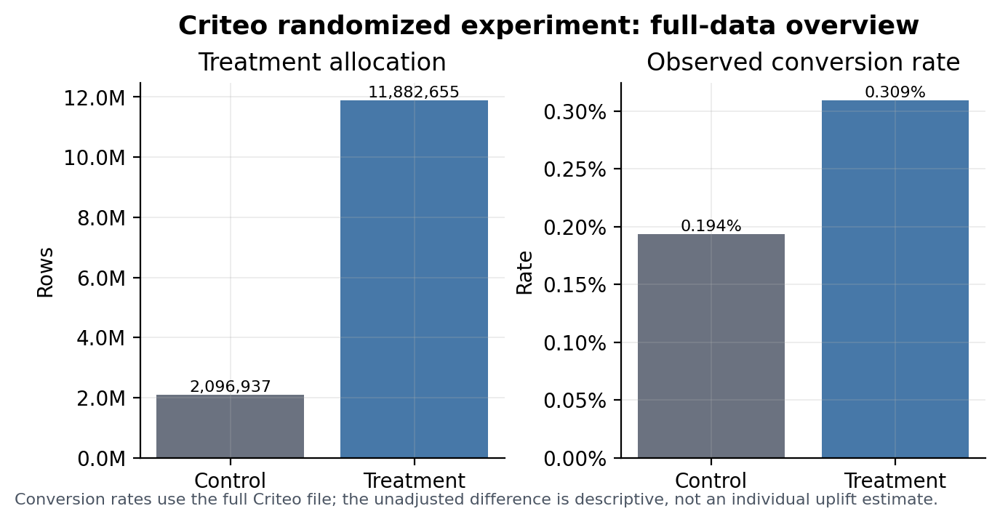
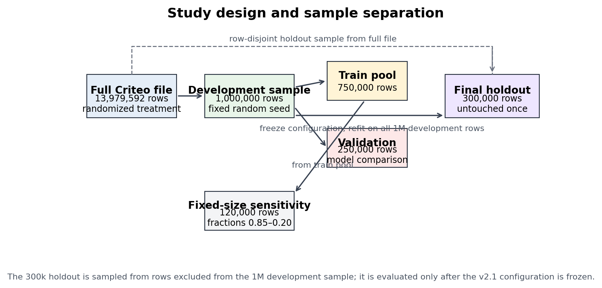
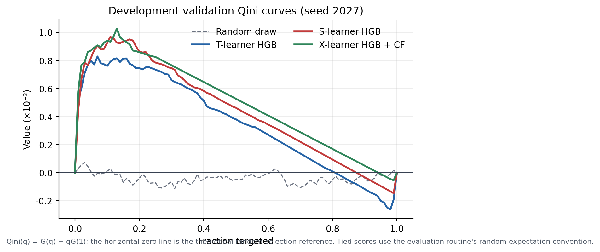
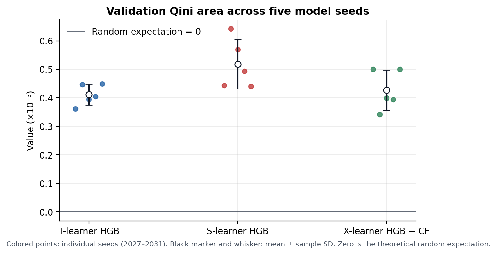
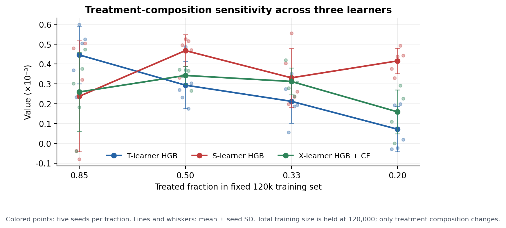
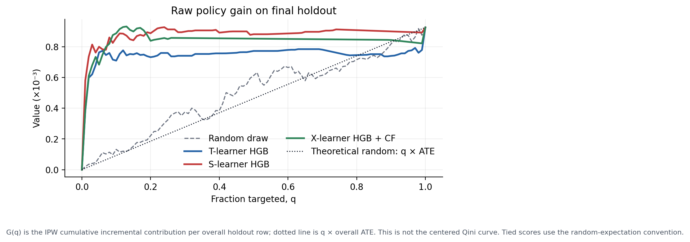
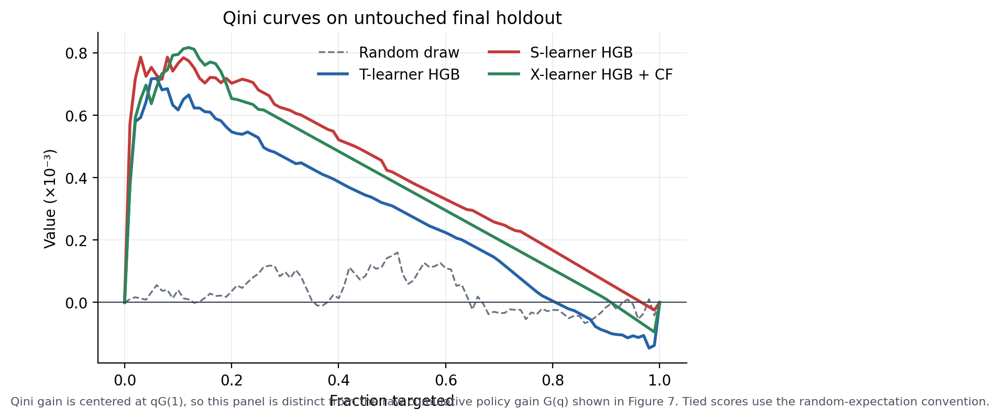
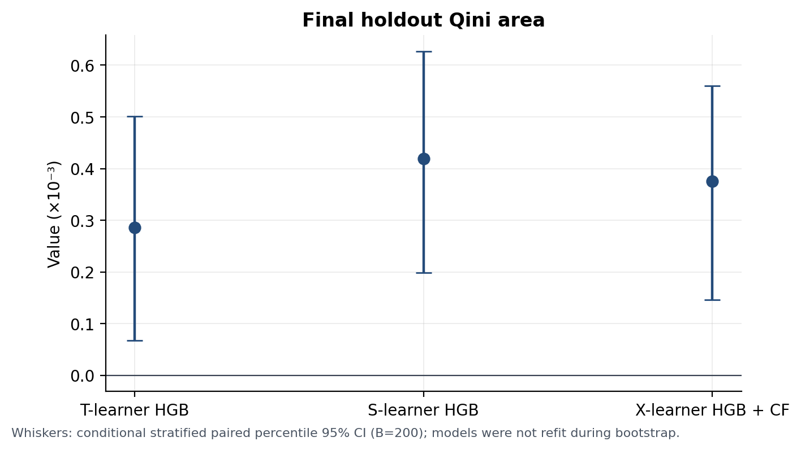
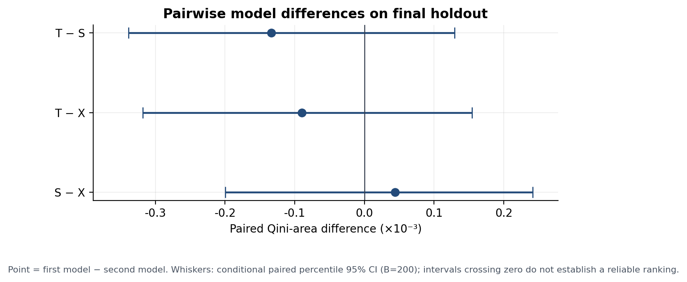

# 从转化预测到增量响应排序：Criteo 随机实验上的 Uplift Modeling 研究

**版本：** v2.1 论文初稿
**数据：** Criteo Uplift Modeling 公共随机实验数据
**研究类型：** 离线方法比较、训练构成敏感性与一次性 holdout 验证
**代码仓库：** [Inori124/uplift-modeling-research](https://github.com/Inori124/uplift-modeling-research)
**状态：** 研究型项目初稿；不代表线上投放收益

## 目录

- [1. 引言](#1-引言)
- [2. 数据](#2-数据)
- [3. 方法](#3-方法)
- [4. 实验设计](#4-实验设计)
- [5. 评估指标](#5-评估指标)
- [6. 结果](#6-结果)
- [7. 讨论](#7-讨论)
- [8. 局限性](#8-局限性)
- [9. 结论](#9-结论)
- [附录 A：复现配置与文件](#附录-a复现配置与文件)

## 摘要

互联网增长策略需要决定“触达哪些用户”，而不是仅预测“哪些用户会转化”。高转化概率用户可能在没有广告或 Push 时也会完成目标行为；对这类用户进行触达会消耗预算，却未必产生增量。Uplift modeling 将目标从条件转化概率扩展为条件平均处理效应（conditional average treatment effect, CATE）：给定处理前特征后，用户被分配到 treatment 与 control 的潜在结果平均差异。

本文使用 Criteo 公共随机实验数据，研究在 treatment 分配不平衡、conversion 稀疏的条件下，T-learner、S-learner 和 X-learner 能否识别具有较高增量响应的用户。建模只使用 12 个处理前匿名特征 `f0`–`f11`；`treatment` 被视为随机分配变量，`conversion` 为结果变量，`visit` 与 `exposure` 不作为输入；因此估计对象是 assignment 的 ITT/CATE，而不是实际 exposure 的效果。主实验从全量数据中固定抽取 1,000,000 行开发集，使用固定的 750,000/250,000 train pool/validation 划分，在统一的未加权 HistGradientBoosting 配置下改变 5 个模型随机种子。X-learner 使用 3-fold training-only cross-fitting 生成结果模型的 out-of-fold 预测。

在统一模型设定的开发验证中，S-learner 的 Qini area 为 `0.000518±0.000087`，X-learner 为 `0.000427±0.000070`，T-learner 为 `0.000412±0.000037`；这里的标准差来自固定数据划分上的模型随机性。冻结配置后，在与开发集按行号不重叠的 300,000 行 holdout 上，S-learner、X-learner 和 T-learner 的 Qini area 分别为 `0.000419`、`0.000375` 和 `0.000285`。模型间 paired bootstrap 区间均跨越 0，因此只能报告点估计的方向性差异，不能宣称某种 learner 在统计意义上确定优于另一种。结果支持“模型能够发现正向离线排序信号”，不支持线上 ROI、收入提升或策略上线效果等强结论。

## 1. 引言

### 1.1 业务动机

在广告、Push、优惠券和推荐场景中，平台通常面临有限的触达资源。普通转化模型估计：

```text
P(Y=1 | X)
```

它回答“谁最可能转化”，但没有回答“谁是因为触达才增加转化”。根据两个潜在结果 `Y(0)` 和 `Y(1)`，可以概念性地将用户分为：

| 类型 | 潜在结果 `(Y(0), Y(1))` | 解释 |
| --- | --- | --- |
| Sure things | `(1, 1)` | 不触达也会转化 |
| Persuadables | `(0, 1)` | 触达后才增加转化，通常是增长策略最希望识别的人群 |
| Lost causes | `(0, 0)` | 无论是否触达都不转化 |
| Sleeping dogs / do-not-disturb | `(1, 0)` | 触达可能抑制原本会发生的转化 |

这是概念分类，单个用户的两个潜在结果不能同时观测，因而不能直接给每个用户贴上真实标签。本文研究的是根据实验数据估计 CATE 并对用户排序。

### 1.2 研究问题

本文回答以下问题：

1. 三种 meta-learner 能否在稀疏 conversion 数据上产生高于随机期望的 Qini 排序信号？
2. 在统一的未加权 HGB 基学习器下，T/S/X-learner 的结果是否一致？
3. X-learner 的 cross-fitting 以及训练集 treatment 构成变化会如何影响结果？
4. 开发验证中的方向能否在冻结配置后的独立 holdout 上复现？

### 1.3 相关工作

Uplift modeling 最初用于直接营销中的 differential response 分析，核心目标是预测干预带来的增量，而非预测总体响应概率。随后，因果推断文献将这一问题与异质性处理效应联系起来；meta-learner 将复杂的 CATE 估计拆解为一个或多个结果模型；Doubly Robust 与 Double/Debiased Machine Learning 则进一步讨论了 nuisance estimation 与正交化。本文选择 T/S/X-learner 作为可解释的基线比较，并把随机实验、IPW 排序评估和样本构成敏感性放在同一个可复现流程中。

本文参考：

1. Radcliffe, N. J., & Surry, P. D. (1999). *Differential response analysis: Modeling true lift*. Direct Marketing Educational Foundation.
2. Gutierrez, P., & Gérardy, J. (2017). *Causal Inference and Uplift Modelling: A Review of the Literature*. Proceedings of Machine Learning Research.
3. Künzel, S. R., Sekhon, J. S., Bickel, P. J., & Yu, B. (2019). *Metalearners for estimating heterogeneous treatment effects using machine learning*. PNAS, 116(10), 4156–4165.
4. Diemert, E., Betlémi, M., Renaudin, C., & Vasile, F. (2018). *A Large Scale Benchmark for Uplift Modeling*. AdKDD / KDD Workshop.
5. Chernozhukov, V. et al. (2018). *Double/debiased machine learning for treatment and structural parameters*. The Econometrics Journal, 21(1), C1–C68.

## 2. 数据

### 2.1 数据来源与变量

数据来自 Criteo Uplift Modeling 公共随机实验。完整文件约 3.25 GB，共 **13,979,592 行**。变量定义和建模边界如下：

| 字段 | 本文角色 | 是否进入模型 | 说明 |
| --- | --- | --- | --- |
| `f0`–`f11` | 处理前特征 `X` | 是 | 匿名数值特征，不赋予业务语义 |
| `treatment` | 分配变量 `T` | 否，作为模型条件或处理变量 | 表示是否被随机分配到 treatment |
| `conversion` | 结果 `Y` | 否，作为训练标签 | 二元转化结果 |
| `visit` | 处理相关结果字段 | 否 | 不作为处理前特征 |
| `exposure` | 曝光/处理后字段 | 否 | treatment 与实际曝光并不等价 |

本文估计的是**被分配到 treatment 的 assignment effect（ITT/CATE of assignment）**，不是实际 `exposure` 的因果效应。由于 control 行的 `exposure` 为 0，按曝光筛选或把 exposure 当特征会改变研究问题并引入处理后信息。

### 2.2 全量数据描述性统计

全量数据的 treatment 比例约为 `0.8500`，conversion 比例约为 `0.2917%`。按 treatment 分组的描述性统计为：

| 分组 | 样本数 | Conversion rate | Visit rate | Exposure rate |
| --- | ---: | ---: | ---: | ---: |
| Control | 2,096,937 | 0.1938% | 3.8201% | 0.0000% |
| Treatment | 11,882,655 | 0.3089% | 4.8543% | 3.6037% |

未调整的 treatment-control conversion rate 差为约 `0.1152` 个百分点。这是总体平均处理效果的描述性估计，不能解释为个体 uplift。



**图 1.** Criteo 全量文件中的 treatment 分配规模和 observed conversion rate。转化率极低，右图单独使用百分比纵轴；该图用于描述数据，不代表模型排序结果。

### 2.3 数据划分与样本隔离

项目采用“开发集探索 + 冻结配置 + 一次性 holdout”的流程。开发集和 holdout 从原始文件中按不同随机规则抽取，按原始行号不重叠。

| 数据部分 | 行数 | 用途 |
| --- | ---: | --- |
| Criteo 全量文件 | 13,979,592 | 数据来源 |
| Development sample | 1,000,000 | 固定开发数据 |
| Train pool | 750,000 | 模型训练与 cross-fitting |
| Development validation | 250,000 | 主实验模型比较 |
| Final holdout | 300,000 | 配置冻结后的单次终局评估 |
| Fixed-size train subset | 120,000 | treatment 构成敏感性 |



**图 2.** 数据流和样本隔离。固定的开发 validation 用于模型探索；最终 holdout 在配置冻结后只评估一次。固定训练量实验从 train pool 抽取 120,000 行，并保持同一 validation。

主实验 `seed=2027` 的样本和 conversion 计数如下：

| 数据部分 | Control n / conversions | Treatment n / conversions |
| --- | ---: | ---: |
| Train pool | 112,202 / 232 | 637,798 / 1,940 |
| Development validation | 37,400 / 68 | 212,600 / 671 |
| Final holdout | 45,021 / 101 | 254,979 / 808 |

由于 conversion 是稀疏事件，validation 的 control 组只有 68 个正例；这也是后文曲线局部波动和 bootstrap 区间宽度的重要背景。

## 3. 方法

### 3.1 CATE 与识别假设

令 `Y(1)` 与 `Y(0)` 表示用户在两种 assignment 状态下的潜在结果，`T∈{0,1}` 表示随机分配，`X` 表示 treatment 之前的特征。本文的目标是估计：

```text
τ(x) = E[Y(1) − Y(0) | X=x]
     = P(Y=1 | T=1, X=x) − P(Y=1 | T=0, X=x)
```

因果解释依赖以下假设：

- **随机化/可交换性：** 在给定实验设计下，`T` 与潜在结果独立；
- **Positivity：** 处理概率严格位于 0 和 1 之间；
- **SUTVA：** 一个用户的处理不改变另一用户的结果，且 treatment 定义稳定；
- **处理前特征：** `X` 不受 treatment 影响；
- **一致性：** 观测到的结果与该用户实际接受的 assignment 状态一致。

Criteo 数据中的 `treatment` 是 assignment 变量，因此本文结论针对 assignment effect。实际 exposure、广告可见性、成本和收益还需要另外的实验设计。

### 3.2 T-learner

T-learner 分别训练两组结果模型：

```text
μ1(x) = P(Y=1 | X=x, T=1)
μ0(x) = P(Y=1 | X=x, T=0)
τ̂(x) = μ̂1(x) − μ̂0(x)
```

处理组约占 85%，对照组约占 15%，因此两组模型的数据量不同。

### 3.3 S-learner

S-learner 使用一个结果模型并将 `T` 作为额外输入：

```text
μ(x, t) = P(Y=1 | X=x, T=t)
τ̂(x) = μ̂(x, 1) − μ̂(x, 0)
```

它共享两组样本的表示和参数，可能降低方差，但也可能限制 treatment 与特征交互的表达。

### 3.4 X-learner 与 cross-fitting

X-learner 先拟合结果模型，再利用对侧结果构造伪处理效应：

```text
d1 = Y − μ̂0(X),  T=1
 d0 = μ̂1(X) − Y, T=0
```

随后分别拟合 `τ1(X)` 和 `τ0(X)`，并使用训练集 treatment 比例 `p_train` 组合：

```text
τ̂(x) = (1 − p_train)τ̂1(x) + p_trainτ̂0(x)
```

本文使用 3-fold `StratifiedKFold` 在 train pool 内生成 `μ̂0`、`μ̂1` 的 out-of-fold 预测，再拟合两组效应模型。cross-fitting 的作用是减少结果模型过拟合对伪处理效应的影响；它不替代随机化、处理前特征边界、positivity 或独立评估集。

### 3.5 统一基学习器与概率校准

v2 主结果统一使用未加权的 `HistGradientBoostingClassifier` 结果模型和 `HistGradientBoostingRegressor` 效应模型，参数如下：

| 模块 | 参数 |
| --- | --- |
| Outcome HGB | `max_iter=50`, `max_leaf_nodes=15`, `learning_rate=0.10`, `l2_regularization=1.0`, `early_stopping=False`, 默认 `max_bins=255` |
| Effect HGB | `max_iter=80`, `max_leaf_nodes=15`, `learning_rate=0.08`, `l2_regularization=1.0`, `early_stopping=False`, 默认 `max_bins=255` |
| Cross-fitting | 3 folds，按 treatment 分层 |

未使用 `class_weight='balanced'` 作为主结果，是因为 balanced 会改变稀疏 conversion 的隐含类别先验，可能使 `predict_proba` 不再对应原始概率尺度。早期 balanced 版本保留为敏感性分析，不能与 v2 结果混合解释。

## 4. 实验设计

### 4.1 固定开发验证划分

Development sample 使用固定 `seed=2027` 抽取，随后使用固定 `split_seed=2027` 划分 750,000 行 train pool 和 250,000 行 development validation。主结果中的 5 个 seed（2027–2031）共享完全相同的行划分，seed 只改变 HGB 的随机过程、cross-fitting 折分和随机排序参考。因此 5 个 seed 的标准差表示当前固定数据划分下的训练/拟合随机性敏感度，不是 5 个独立数据集的泛化标准误。

### 4.2 固定训练量的 treatment 构成实验

从同一 train pool 中固定抽取 120,000 行，只改变 treated fraction：`0.85`、`0.50`、`0.33`、`0.20`。抽样只依赖 treatment，不查看 conversion。该实验同时改变各组样本量和 X-learner 的 `p_train` 混合权重，因此应解释为“固定训练量下 treatment 构成与 X mixing weight 的联合敏感性”，不能孤立归因于 propensity。

### 4.3 最终 holdout

模型配置、基础学习器和评估口径冻结后，使用完整 1M development sample 训练固定 v2.1 配置，在 row-disjoint 的 300,000 行 final holdout 上只评估一次。Holdout 没有参与模型选择。

## 5. 评估指标

### 5.1 IPW cumulative gain

评估集 treatment 分配概率使用 `p=mean(T)` 作为 plug-in；正式复现时应优先核对官方设计概率。每个样本的 IPW 增量贡献为：

```text
z_i = T_iY_i/p − (1−T_i)Y_i/(1−p)
```

按预测 uplift 降序排列后，前 `q` 比例的总体归一化累计增量为：

```text
G(q) = (1/N) Σ_{i in top-q} z_i
```

`G(q)` 的分母是整个评估集 `N`。被选中人群内部的平均增量为 `G(q)/q`。例如，final holdout 上 S-learner 的 Top20 policy gain `0.000887` 相当于总体每用户 `0.0887` 个百分点的离线增量估计；对应的 selected ATE `0.004437` 是被选中 20% 人群内部约 `0.4437` 个百分点。它们都不是 ROI。

### 5.2 AUUC 与 Qini area

```text
AUUC = ∫₀¹ G(q)dq
Qini(q) = G(q) − qG(1)
Qini area = ∫₀¹ Qini(q)dq
```

Qini 扣除了同一覆盖比例下的理论随机期望。论文图中的 Qini 纵轴均指 `G(q)−qG(1)`，不是原始 `G(q)`。

### 5.3 随机参考与 ties

结果文件中的 `Random draw` 是一次随机分数排列，带有有限样本噪声；`random_expectation` 是理论随机选择基线，Qini area 恒为 0。相同预测分数的 ties 使用等比例选择的期望处理，避免指标依赖输入行顺序。

### 5.4 不确定性

Bootstrap 使用 B=200 次 treatment 分层的 paired percentile resampling。每次重抽样对所有模型使用相同的行重复计数，固定已训练模型分数，不重新训练。因此它是**条件于当前评估集、当前拟合模型和当前分数的探索性区间**，不包含模型选择、超参数搜索或重新训练的不确定性。正式研究可将 B 提高到至少 1,000。

## 6. 结果

### 6.1 开发验证中的模型比较



**图 3.** `seed=2027` development validation 的 Qini 曲线。横轴是按预测 uplift 排序后选择的覆盖比例，纵轴是扣除同覆盖率理论随机期望后的累计增量 `G(q)−qG(1)`；灰色虚线是一次随机排列，不是理论随机期望。



**图 4.** 固定开发验证划分上 5 个模型 seed 的 Qini area。彩色点是单个 seed，黑色点和误差条是均值 ± 样本标准差；零线是理论随机期望。这里的误差条描述模型随机性，不是独立数据抽样误差。

| 方法 | Qini area（mean ± SD） | AUUC（mean ± SD） | Top10 policy gain | Top20 policy gain | Top30 policy gain |
| --- | ---: | ---: | ---: | ---: | ---: |
| Random draw | 0.000005 ± 0.000047 | 0.000674 ± 0.000047 | 0.000136 | 0.000274 | 0.000407 |
| T-learner HGB | 0.000412 ± 0.000037 | 0.001081 ± 0.000037 | 0.000974 | 0.001080 | 0.001112 |
| S-learner HGB | **0.000518 ± 0.000087** | **0.001187 ± 0.000087** | **0.001135** | **0.001205** | **0.001205** |
| X-learner HGB + CF | 0.000427 ± 0.000070 | 0.001096 ± 0.000070 | 0.000989 | 0.001060 | 0.001107 |

在统一未加权 HGB 设定下，S-learner 的平均 Qini area 和 Top20 policy gain 最高；X-learner 次之。这个观察与早期使用类别加权、且 T/S 与 X 基础模型不同的 legacy 结果不完全一致，因此不能把差异归因于 learner 结构本身。

### 6.2 固定训练量的 treatment 构成敏感性



**图 5.** 固定训练量为 120,000 时三种 learner 的 Qini area。点为每个 fraction 下的 5 个 seed，线和误差条为均值 ± seed SD；validation 固定不变。该图研究的是 treatment 构成、各组样本量和 X mixing weight 的联合敏感性。

| Treated fraction | T-learner HGB | S-learner HGB | X-learner HGB + CF |
| ---: | ---: | ---: | ---: |
| 0.85 | 0.000446 ± 0.000146 | 0.000237 ± 0.000280 | 0.000259 ± 0.000198 |
| 0.50 | 0.000293 ± 0.000119 | 0.000468 ± 0.000080 | 0.000342 ± 0.000045 |
| 0.33 | 0.000212 ± 0.000110 | 0.000330 ± 0.000148 | 0.000312 ± 0.000068 |
| 0.20 | 0.000071 ± 0.000114 | 0.000416 ± 0.000064 | 0.000159 ± 0.000111 |

X-learner 在 `0.50` 与 `0.33` 条件下的均值高于 `0.85`，在 `0.20` 条件下下降；未呈现单调关系。该结果只说明当前样本量、抽样策略和模型配置下的离线表现，不支持某个 treatment fraction 是普遍最优。

### 6.3 最终 holdout



**图 6.** Final holdout 的原始 IPW cumulative policy gain `G(q)`。虚线为一次随机排列；点线为理论随机 `q×ATE`。该图与 Qini 图不同：它没有扣除随机期望。



**图 7.** Final holdout 的 Qini 曲线，纵轴为扣除同覆盖率随机期望后的累计增量。曲线前段反映低预算覆盖比例下的排序效果。



**图 8.** 冻结 v2.1 配置在 final holdout 上的 Qini area。误差条是 B=200 的条件 paired bootstrap percentile interval；不包含重新训练和模型选择不确定性。

| 方法 | AUUC | Qini area | Top10 policy gain | Top20 policy gain | Top30 policy gain | Top20 selected ATE |
| --- | ---: | ---: | ---: | ---: | ---: | ---: |
| Random draw | 0.000494 | 0.000031 | 0.000132 | 0.000221 | 0.000376 | 0.001106 |
| T-learner HGB | 0.000748 | 0.000285 | 0.000709 | 0.000732 | 0.000741 | 0.003658 |
| S-learner HGB | **0.000882** | **0.000419** | 0.000859 | **0.000887** | **0.000898** | **0.004437** |
| X-learner HGB + CF | 0.000838 | 0.000375 | **0.000887** | 0.000838 | 0.000856 | 0.004191 |

300,000 行 holdout 上，S-learner 的 Top20 policy gain 乘以样本数约为 266 个 IPW-equivalent incremental conversions；这是将离线估计换算为样本规模的数学结果，不是线上预期转化数或收入。



**图 9.** Holdout 上模型两两 Qini area 差异。点为第一种模型减去第二种模型，误差条为 B=200 的条件 paired bootstrap percentile interval。所有模型间区间跨过 0：

| 差异 | 点估计 | 95% 条件 paired CI |
| --- | ---: | ---: |
| T − S | -0.000134 | [-0.000339, 0.000129] |
| T − X | -0.000090 | [-0.000318, 0.000154] |
| S − X | 0.000044 | [-0.000200, 0.000242] |

因此可以说 S-learner 在本次 holdout 的点估计最高，但不能说它相对于 X-learner 或 T-learner 已建立确定性优势。相对理论随机期望的各模型 Qini 条件区间分别为 T `[0.000067, 0.000501]`、S `[0.000199, 0.000627]`、X `[0.000146, 0.000560]`；这只说明当前固定分数下的区间没有覆盖 0，不等于线上实验显著性。

## 7. 讨论

### 7.1 为什么统一后结论与早期结果不同

早期 X-learner 结果使用类别加权的 logistic outcome model，且 X 的效应模型与 T/S 的 logistic 基础模型不同。类别加权会改变 `predict_proba` 的概率尺度；不同效应模型又把 learner 结构、函数复杂度和优化偏差混合在一起。v2 统一使用未加权 HGB，结果显示 S-learner 点估计最高，说明模型比较必须先固定基础学习器和概率尺度。

### 7.2 稀疏 conversion 对评估的影响

Seed 2027 validation 只有 68 个 control conversions（37,400 个 control 行）和 671 个 treatment conversions（212,600 个 treatment 行）。稀疏事件使 IPW 累计曲线容易受到少量样本影响，也解释了为什么 Top-K gain、Qini area 和不同 seed 的曲线可能出现局部波动。报告点估计时同时给出 seed SD、条件 bootstrap 区间和最终 holdout，是为了避免把单次曲线形状误当成稳定规律。

### 7.3 训练构成实验的含义

固定 120,000 行后改变 treated fraction，会同时改变 treated/control 的有效样本量、伪处理效应的噪声水平和 X-learner 的组合权重。该设计适合回答“训练构成变化下，当前流程是否敏感”，不适合孤立识别真实业务 propensity 的因果作用。若要单独研究 propensity，应固定总样本量、固定 X mixing weight，并使用明确的采样设计。

## 8. 局限性

1. **Assignment 与 exposure 的区别：** 结果针对 treatment assignment，不是实际曝光；线上广告可见性、频次和触达成本未建模。
2. **处理概率 plug-in：** 当前使用评估集 `mean(T)`；应在正式复现时核对 Criteo 发布方的实验设计概率。
3. **匿名特征：** `f0`–`f11` 没有业务语义，无法把模型排序转化为可解释的人群规则。
4. **稀疏结果：** 对照组 conversion 数较少，Qini/AUUC 对抽样和少量事件较敏感。
5. **单一公开数据集：** 开发集与 holdout 来自相同公开分布，不是跨时间、跨业务线或外部数据验证。
6. **模型与调参范围：** 只比较三种 learner 和一组 HGB 配置；paired bootstrap 不包含重新训练、超参数搜索和模型选择不确定性。
7. **固定训练构成实验：** 虽然总训练量固定，但 treatment fraction 改变了 X mixing weight；它不是纯 propensity 敏感性实验。
8. **不确定性规模：** B=200 适合当前项目的探索性报告，正式论文应增加 bootstrap 次数并预先定义比较与多重检验方案。

## 9. 结论

本文完成了从数据检查、总体处理效果描述、T/S/X-learner、cross-fitting、统一基础学习器比较、固定训练量构成敏感性到最终 holdout 的可复现实验闭环。

当前证据支持三点：

1. 在 Criteo 公开随机实验数据上，三种 learner 都产生了高于理论随机期望的正向离线排序信号；
2. 在统一未加权 HGB 配置下，S-learner 在开发验证和最终 holdout 上的 Qini area 点估计均最高，X-learner 次之；
3. treatment 构成变化会影响不同 learner 的结果，但影响没有呈现简单单调规律。

当前证据不支持三点：

1. 不支持把 S-learner、X-learner 或 T-learner 宣称为普遍最优；模型间 paired CI 跨 0；
2. 不支持把离线 policy gain 写成线上 ROI、收入提升或节省预算；
3. 不支持把 treatment assignment 的离线结果直接解释为实际 exposure 的效果。

## 附录 A：复现配置与文件

主实验使用 Python 3.9.6、NumPy 2.0.2、Pandas 2.3.3、scikit-learn 1.6.1、SciPy 1.13.1、Matplotlib 3.9.4、threadpoolctl 3.6.0。开发集和 holdout 的原始 CSV 不提交 GitHub；仓库只保存代码、汇总结果和图表。

关键文件：

- `src/run_v2_experiment.py`：单次统一模型实验；
- `src/run_study_v2.py`：主实验与固定训练量实验编排；
- `src/run_final_holdout.py`：冻结配置的一次性 holdout；
- `src/evaluation_v2.py`：tie-safe 指标和 paired bootstrap；
- `src/plot_paper_figures.py`：论文图表生成；
- `results/v2_summary.json`：5 个 model seed 的主结果；
- `results/final_holdout.json`：holdout 点估计、曲线与区间；
- `tests/`：指标、抽样和 cross-fitting 流程测试。

运行：

```bash
python3 -m unittest discover -s tests -v
MPLBACKEND=Agg python3 src/plot_paper_figures.py
PYTHONPATH=src python3 src/run_study_v2.py --suite all --workers 2 --bootstrap 200
```

## 附录 B：评估伪代码

```text
fit models on train pool only
for each evaluation row i:
    z_i = T_i * Y_i / p - (1-T_i) * Y_i / (1-p)
for each model:
    sort evaluation rows by predicted uplift
    aggregate equal-score blocks
    compute G(q) on block endpoints
    AUUC = integral G(q)
    Qini(q) = G(q) - q * G(1)
    Qini area = integral Qini(q)
    report G(0.10), G(0.20), G(0.30)

for bootstrap b in 1..B:
    resample treatment and control rows separately with replacement
    reuse fixed model scores and common row multiplicities
    recompute Qini area and Top20 policy gain for every model
return percentile intervals and paired model differences
```

## 附录 C：研究状态与简历表述

当前项目适合写成：

> 基于 Criteo 随机实验数据构建用户增量响应建模流程，统一比较 T/S/X-learner，使用 IPW Qini、AUUC、Top-K policy gain、cross-fitting 和固定训练量 treatment 构成实验分析模型排序效果与稳健性。

不应写成“线上 ROI 提升”“带来收入增长”或“模型在所有 treatment 比例下稳定”。
